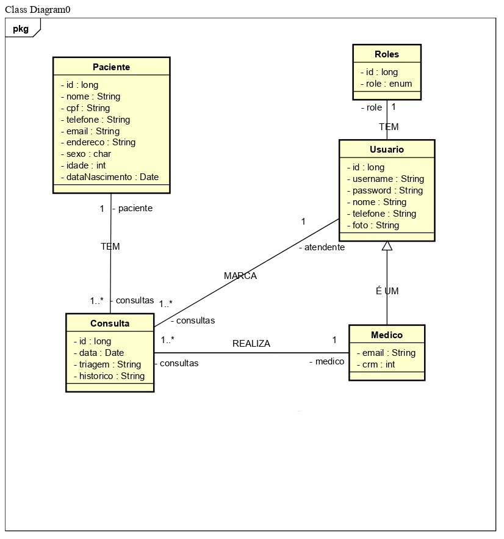

<!DOCTYPE html>
<html>
<body>

<h1 align="center">Corleone-MedLife</h1>

<h3 align="center">Aplicação para uma uma clínica que faz consultas médicas, atendente realiza o cadastro do paciente para consulta e o médico realiza a mesma.</h3>

 

  <a href="#">//TODO link app</a>

 

  Login: admin / Senha: admin
   
  Login: medico / Senha: medico
   
  Login: atendente / Senha: atendente

 

  

      
<strong>Requisitos</strong>

       
      

        

          
<strong>Requisitos do Sistema</strong>

           
          <ul>
          

            <li>Gerenciar cadastro dos pacientes.
            </li>
            <li>Cadastrar nova consulta que cai na fila do atendimento.
            </li>
            <li>Verificar consulta marcada e cancelar caso paciente não chegar em até 10 minutos antes da cosulta.
            </li>
            <li>Na data da consulta, encaminhar os dados do paciente para o médico responsável.
            </li>
            <li>Imprimir relatório com os exames e medicamentos de acordo com o diagnóstico do médico.
            </li>
            <li>Repassar possível retorno para o cadastro de cliente.
            </li>
            <li>Encerrar com a conclusão do atendimento e diagnóstico.
            </li>
             
          

          </ul>
        

      

      

        

          
<strong>Casos de uso</strong>

        

        

        

          
<strong>Admin</strong>

           
          

          CRUD do sistema.
          <ul>
            <li>Registrar dados de um novo atendente ou médico no banco de dados. Buscar, alterar e excluir.
            <ol><u>Entrada esperada:</u>
            </ol>
            <ol>-Paciente: Id, nome, endereço, telefone, idade, sexo, cpf, email
            </ol>
            <ol>-Médico: id, nome, telefone, foto, fotoExt, email, crm
            </ol>
            <ol><u>Saída esperada:</u>
            </ol>
            <ol>-Cadastro de um novo atendente no sistema.
            </ol>
            <ol>-Cadastro de um novo médico sistema.
            </ol>
            <ol>-Lista com todos os dados de médicos e atendentes com opção para editar/excluir.
            </ol>
            </li>
          </ul>
          

        

      

      

        

          
<strong>Atendente</strong>

           
          

          Paciente entra em contato com a clínica - Cadastro.
          <ul>
            <li>Registrar dados pessoais e triagem do paciente para consulta.
            <ol><u>Entrada esperada:</u>
            </ol>
            <ol>-Paciente: Id, nome, endereço, telefone, idade, sexo, cpf, email
            </ol>
            <ol>-Consulta: Descrição da necessidade detalhada.
            </ol>
            <ol><u>Saída esperada:</u>
            </ol>
            <ol>-Cadastro de um novo paciente no banco de dados.
            </ol>
            <ol>-Dados da triagem para o preparar o médico.
            </ol>
            <ol>-Data/Hora da consulta marcada com os dados do paciente..
            </ol>
            <ol>**Encaminhar por email ou SMS dados da consulta.
            </ol>
            </li>
          </ul>
          Paciente chega na clínica - Consulta marcada/retorno:
          <ul>
            <li>Confirmar dados pessoais e horário para consulta/retorno.
            <ol><u>Entrada esperada:</u>
            </ol>
            <ol>-Buscar dados do paciente no banco de dados e confirmar o registro do paciente tal como a consulta.
            </ol>
            <ol>-Encaminhar dados para o médico responsável.
            </ol>
            <ol><u>Saída esperada:</u>
            </ol>
            <ol>-Encaminhar dados da consulta para o sistema do médico.
            </ol>
            </li>
          </ul>
          Paciente não comparece na clínica 10 minutos antes de consulta:
          <ul>
            <li>Caso atendente entrar em contato minutos antes e confirmar a ausência do paciente, remarcar. Caso contrário cancelar consulta.
            <ol><u>Entrada esperada:</u>
            </ol>
            <ol>-Criar uma nova consulta e substituir a antiga com os mesmo dados do paciente.
            </ol>
            <ol>-Cancelar consulta em sistema.
            </ol>
            <ol><u>Saída esperada:</u>
            </ol>
            <ol>-Data/Hora da consulta remarcada marcada com os dados do paciente.
            </ol>
            <ol>-Lista com todos os dados de médicos e atendentes com opção para editar/excluir.
            </ol>
            <ol>**Encaminhar por email ou SMS dados da consulta / cancelamento.
            </ol>
            </li>
          </ul>
          

        

      

      

        

          
<strong>Médico</strong>

           
          

          Recebe uma um registro para nova consulta do paciente:
          <ul>
            <li>Incrementa os dados da consulta com informações da avaliação do médico.
            <ol><u>Entrada esperada:</u>
            </ol>
            <ol>-Recebe dados da consulta/paciente, enviados pelo atendente.
            </ol>
            <ol>-Incrementa no campo de consulta, informações do paciente.
            </ol>
            <ol>-Gera um arquivo com a receita e/ou exames necessários para retorno.
            </ol>
            <ol><u>Saída esperada:</u>
            </ol>
            <ol>-Atualização da entidade consulta no banco de dados.
            </ol>
            <ol>-Criação de um PDF para impressão, com informações necessárias para o paciente.
            </ol>
            </li>
          </ul>
          Recebe uma um registro de retorno do paciente:
          <ul>
            <li>Incrementa os dados da consulta com informações da avaliação do médico e exames.
            <ol><u>Entrada esperada:</u>
            </ol>
            <ol>-Recebe dados da consulta/paciente, enviados pelo atendente.
            </ol>
            <ol>-Incrementa no campo de consulta, informações do paciente.
            </ol>
            <ol>-Gera um arquivo com a receita e/ou exames necessários para outro retorno.
            </ol>
            <ol>-Finaliza o atendimento não havendo a necessidade de mais informações.
            </ol>
            <ol>-Gera um arquivo com diagnóstico final e possíveis medicamentos necessários.
            </ol>
            <ol><u>Saída esperada:</u>
            </ol>
            <ol>-Atualização da entidade consulta no banco de dados.
            </ol>
            <ol>-Criação de um PDF para impressão, com informações necessárias para o paciente.
            </ol>
            <ol>-Finaliza o atendimento.
            </ol>
            </li>
          </ul>
          

        

      

    

   

  

   

  

    
<strong>App Roadmap</strong>

    

       
      

      Task 1 : CRUD de sistema, relacionamentos entre entidades, encaminhamento de consulta do atendente para médico.
      
- Back-End:

      <ul>
        <li>Configuração com banco de dados H2 para testes.
        </li>
        <li>Criação das entidades e mapeamento Hibernate/Validation.
        </li>
        <li>Criação de todos repositórios.
        </li>
        <li>Criação de todos controllers, pelo menos com o método 'find' para testar relacionamentos.
        </li>
        <li>Database seeding para testes.
        </li>
        <li>//TODO Controller com CRUD completo para entidades médico, paciente, atendente, consulta, com testes no h2.
        </li>
        <li>//TODO Parte de configurações de usuário com Upload de foto de perfil, salvando no banco de dados.
        </li>
        <li>//TODO Criação de relatórios com JasperReport.
        </li>
        <li>** Foi adicionado a entidade Consulta o atributo STATUS(MARCADA, ENCAMINHADA, FINALIZADA, REMARCADA, CANCELADA) para melhor controle dos atendimentos.
        </li>
      </ul>
      
- Front-End:

      <ul>
        <li>Configuração bootstrap.
        </li>
        <li> View admin-profile: views de cadastro para novo atendente, médico.
        </li>
        <li>View admin-profile: view de lista dinâmica de todos atendentes, médicos com opção para editar e excluir.
        </li>
        <li>View atendente profile: view de cadastro para novo paciente.
        </li>
        <li>View atendente profile: view de lista dinâmica com todos pacientes, com opção de editar, enviar mensagem via API whattsap.
        </li>
        <li>//TODO View atendente profile: view com lista das consultas agendadas, com opção de remarcar, cancelar, encaminhar para determinado médico.
        </li>
        <li>//TODO View atendente profile: view com dados dos médicos para consulta de dados.
        </li>
        <li>//TODO View atendente profile: configurações de perfil ( alteração de telefone, email, foto ).
        </li>
        <li>//TODO View médico profile: view com lista de consultas que foram encaminhadas pelo atendente, com opção de finalizar e remarcar.
        </li>
        <li>//TODO View médico profile: view da consulta em andamento para registro de informações sobre.
        </li>
        <li>//TODO View médico profile: view do relatório para solicitar exames ou medicamentos.
        </li>
        <li>//TODO View médico profile: ( alteração de telefone, email, foto ).
        </li>
        <li>Paginação das listas dinâmicas e busca de pacientes por nome.
        </li>
      </ul>
      

      Task 2 - Spring security, autenticando o sistema e autorizando páginas de acordo com o perfil.
      <ul>
        <li>//TODO Validação com banco de dados, login/senha.
        </li>
        <li>//TODO Validação para não acessar nenhuma página do sistema sem estar logado.
        </li>
        <li>//TODO O usuário 'admin' tem acesso total ao sistema.
        </li>
        <li>//TODO View admin-profile: view do log que contém alterações de data da consulta, ou cancelamento de consulta.
        </li>
      </ul>
    

    

  

 

  

    
<strong>UML</strong>

     
    

    
    

    

 

  

    
<strong>Imagens</strong>

     
    

    //TODO
    

 

  <h3>Tecnologias utilizadas</h3>
  
Java, Thymeleaf, Spring Boot, Spring MVC, Spring Security, Spring Data JPA, Spring Validation, HTML, CSS, JS, Bootstrap, PostgreSQL, Maven, Tomcat 9, Git e Github

 

  

</body>
</html>
